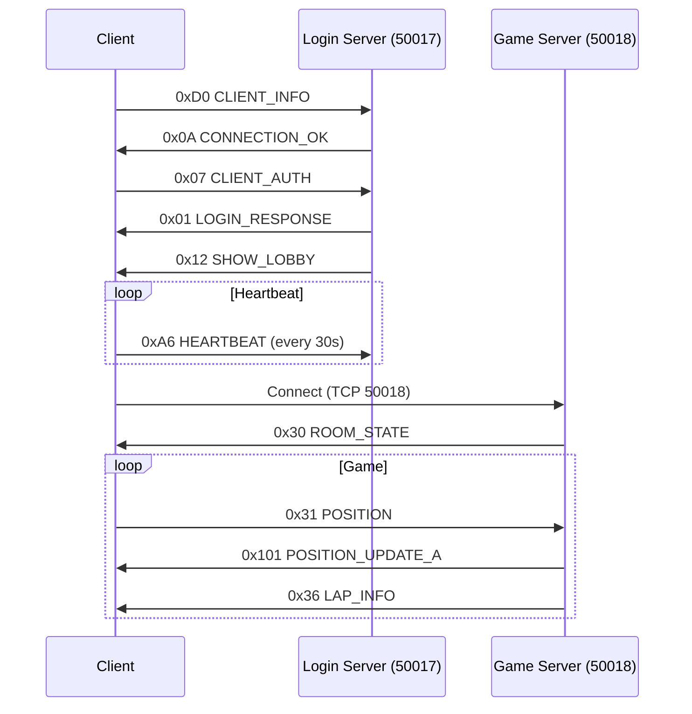

# KnC Protocol Documentation

**Complete network protocol documentation for Kart n' Crazy (KnC)**

---

## Main Index

| Document | Description |
|----------|-------------|
| **[PROTOCOL_OVERVIEW.md](PROTOCOL_OVERVIEW.md)** | Complete protocol overview |
| **[STRUCTURES.md](STRUCTURES.md)** | Detailed C++ structures (PlayerInfo, VehicleData, etc.) |
| **[MESSAGES.md](MESSAGES.md)** | Message types and formats |

---

## Packets by Category (179 files)

### [auth/](auth/) - Authentication & Session (17 packets)
Connection management, authentication, heartbeat

| Opcode | Name | Description |
|--------|------|-------------|
| 0x01 | LOGIN_RESPONSE | Login response |
| 0x02 | DISPLAY_MESSAGE | Display message |
| 0x03 | CHARACTER_CREATION_TRIGGER | Character creation trigger |
| 0x04 | REGISTRATION_RESPONSE | Registration response |
| 0x07 | SESSION_INFO | Session info |
| 0x0A | CONNECTION_OK | Connection OK |
| 0x0B | ACK | Acknowledgment |
| 0x0C | DATA_PAIRS | Key/value pairs |
| 0x0D | FLAG_SET | Flag configuration |
| 0x12 | SHOW_LOBBY | Show lobby |
| 0x8E | NO_HANDLER | No handler |
| 0xA6 | HEARTBEAT | Heartbeat |
| 0xA7 | SESSION_CONFIRM | Session confirm |
| 0xAA | PLAYER_PREVIEW | Player preview |

[See all auth/ packets](auth/)

---

### [chat/](chat/) - Chat & Messaging (9 packets)
Messages, whispers, players

| Opcode | Name | Description |
|--------|------|-------------|
| 0x116 | PLAYER_NAME | Player name |
| 0x117 | PLAYER_REMOVE | Remove player |
| 0x2A | WHISPER_ENABLE | Enable whisper |
| 0x2B | WHISPER_DISABLE | Disable whisper |
| 0x2D | CHAT_MESSAGE | Chat message |
| 0x2E | PLAYER_LEFT | Player left |
| 0x6C | PLAYER_MESSAGE | Player message |
| 0x6E | MESSAGE_DISPLAY | Display message |

[See all chat/ packets](chat/)

---

### [client/](client/) - Client → Server (9 packets)
Packets sent by client

| Opcode | Name | Description |
|--------|------|-------------|
| 0x07 | CLIENT_AUTH | Client authentication |
| 0x19 | SERVER_QUERY | Server query |
| 0x2C | STATE_CHANGE | State change |
| 0x32 | UNKNOWN | Unknown |
| 0x4D | REQUEST_DATA | Request data |
| 0x73 | DISCONNECT | Disconnect |
| 0xD0 | CLIENT_INFO | Client info |
| 0xFA | FULL_STATE | Full state |

[See all client/ packets](client/)

---

### [game/](game/) - Game & Racing (71 packets)
Racing, items, positions, results

#### Position & Movement
- 0x31 POSITION
- 0x100 POSITION_REMOVE
- 0x101 POSITION_UPDATE_A
- 0x102 POSITION_UPDATE_B
- 0xFC POSITION_LIST
- 0xFE POSITION_ADD

#### Race State
- 0x14 GAME_MODE
- 0x30 ROOM_STATE
- 0x33 GAME_STATE
- 0x34 READY_FLAG
- 0x3B COUNTDOWN
- 0x3C RACE_END
- 0x40 START_RACE

#### Lap & Track
- 0x36 LAP_INFO
- 0xF3 TRACK_DATA
- 0xF4 CHECKPOINT_LIST
- 0xF6 RACE_INIT
- 0xF7 RACE_WAYPOINTS
- 0xF9 CHECKPOINT_ADD
- 0xFB LAP_DATA

#### Items
- 0x37 ITEM_USE
- 0x38 ITEM_HIT
- 0x45 ITEM_USAGE
- 0x10D ITEM_BLOCK
- 0x10F ITEM_LIST_UPDATE
- 0x115 ITEM_VALUE

#### Results
- 0x35 SCORE
- 0x39 FINISH
- 0x3A RESULTS

[See all 71 game/ packets](game/)

---

### [inventory/](inventory/) - Inventory & Items (32 packets)
Inventory, vehicles, accessories

#### Item Management
- 0x70 INVENTORY_UPDATE
- 0x78 ITEM_LIST
- 0x79 ITEM_LIST_B
- 0x81 RESULT_CODE
- 0x84 ITEM_FLAG
- 0x85 ITEM_UPDATE_B
- 0x8C EQUIP_ITEM

#### Shop Data
- 0x82 SHOP_DATA
- 0x83 SHOP_DATA_ALT

#### Slot Management
- 0x88 SLOT_LIST
- 0x8A SLOT_ENTRY

#### Add Items
- 0x98 GIFT
- 0x9D ADD_VEHICLE
- 0x9E ADD_ITEM
- 0x9F ADD_ACCESSORY

[See all inventory/ packets](inventory/)

---

### [room/](room/) - Room Management (18 packets)
Game room management

| Opcode | Name | Description |
|--------|------|-------------|
| 0x21 | ROOM_FULL / ROOM_PLAYER_INFO | Room/player info |
| 0x22 | LEAVE_ROOM | Leave room |
| 0x23 | PLAYER_UPDATE | Player update |
| 0x25 | ROOM_STRING | Room string |
| 0x27 | ROOM_INFO_ALT | Room info alt |
| 0x28 | ENTITY_DATA | Entity data |
| 0x30 | ROOM_STATE | Room state |
| 0x3E | PLAYER_JOIN | Player join |
| 0x3F | ROOM_INFO | Room info |
| 0x62 | TUTORIAL_FAIL | Tutorial fail |
| 0x63 | CREATE_ROOM | Create room |
| 0xBF | ROOM_LIST | Room list |
| 0xC0 | ROOM_DETAIL | Room detail |
| 0xC1 | ROOM_LIST_B | Room list B |
| 0xC2 | ROOM_STATUS | Room status |
| 0xC3 | ROOM_DATA | Room data |
| 0xC5 | ROOM_INFO_EXT | Room info extended |

[See all room/ packets](room/)

---

### [shop/](shop/) - Shop (8 packets)
Game shop

| Opcode | Name | Description |
|--------|------|-------------|
| 0x6F | SHOP_ACTION | Shop action |
| 0x72 | DATA_BLOCK | Data block |
| 0x73 | SLOT_UPDATE | Slot update |
| 0x74 | UNKNOWN | Unknown |

[See all shop/ packets](shop/)

---

### [system/](system/) - System (9 packets)
System packets

| Opcode | Name | Description |
|--------|------|-------------|
| 0xAA | PLAYER_DATA | Player data |
| 0xB5 | DUAL_PLAYER_INFO | Dual player info |
| 0xCD | AUDIO_CONTROL | Audio control |
| 0xEE | ENTITY_UPDATE | Entity update |
| 0xF0 | ENTITY_REMOVE | Entity remove |
| 0xF1 | ENTITY_DATA | Entity data |

[See all system/ packets](system/)

---

### [ui/](ui/) - User Interface (19 packets)
UI transitions, screen states

| Opcode | Name | Description |
|--------|------|-------------|
| 0x10A | TRIGGER_UI_18 | Trigger UI 18 |
| 0x10E | TRIGGER_UI_19 | Trigger UI 19 |
| 0x13 | PLAYER_ROOM_DATA | Player/room data |
| 0x16 | UI_STATE_14 | UI state 14 |
| 0x18 | STRING_PARAMS | String params |
| 0x62 | TUTORIAL_FAIL | Tutorial fail |
| 0xB6 | DISPLAY_TEXT | Display text |

[See all ui/ packets](ui/)

---

## Typical Flow

---

## How to Use This Documentation

### 1. **Find a Packet by Opcode**
Search for the opcode (e.g. 0x31) in the tables above, then click on the category link.

### 2. **Understand the Global Protocol**
Read [PROTOCOL_OVERVIEW.md](PROTOCOL_OVERVIEW.md) for the complete overview.

### 3. **Implement a Handler**
1. Find the packet in the appropriate category
2. Read the structure in the .md file
3. Reference [STRUCTURES.md](STRUCTURES.md) for complex types
4. See [../client-clone/05_network_protocol.md](../client-clone/05_network_protocol.md) for implementation

### 4. **Debug a Packet**
Use `tools/packet_inspector` to capture and analyze packets in real-time.

---

## Tools

| Tool | Description |
|------|-------------|
| **[packet_inspector](../../tools/packet_inspector/)** | Sniff/decode network packets |
| **[network_decrypt](../../tools/network_decrypt/)** | Decrypt Network2.ini |

---

## Related Documentation

- [Client Architecture](../architecture/CLIENT_ARCHITECTURE.md)
- [Network Protocol Implementation](../client-clone/05_network_protocol.md)
- [File Formats](../formats/FILE_FORMATS.md)
- [IDA Reverse Engineering Guide](../reverse/IDA_GUIDE.md)

---

## Documentation Status

| Category | Packets | Documented | Status |
|----------|---------|------------|--------|
| auth | 17 | 17 | ✅ 100% |
| chat | 9 | 9 | ✅ 100% |
| client | 9 | 9 | ✅ 100% |
| game | 71 | 71 | ✅ 100% |
| inventory | 32 | 32 | ✅ 100% |
| room | 18 | 18 | ✅ 100% |
| shop | 8 | 8 | ✅ 100% |
| system | 9 | 9 | ✅ 100% |
| ui | 19 | 19 | ✅ 100% |
| **TOTAL** | **192** | **192** | **✅ 100%** |

---

**Last Updated:** December 2025  
**Method:** IDA Pro + Ghidra + DevClient testing
